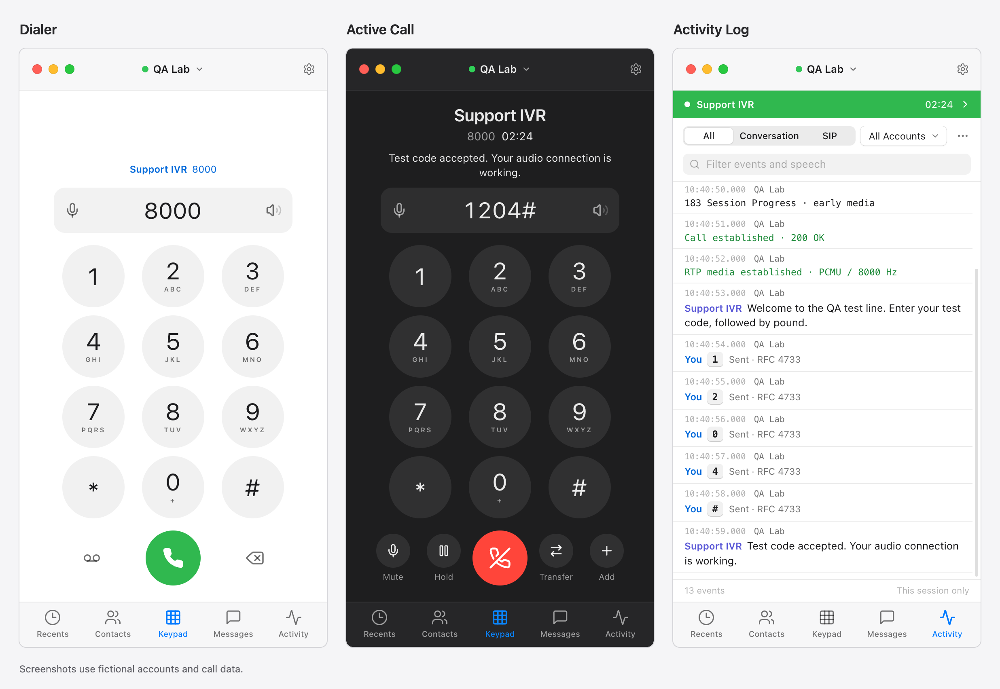
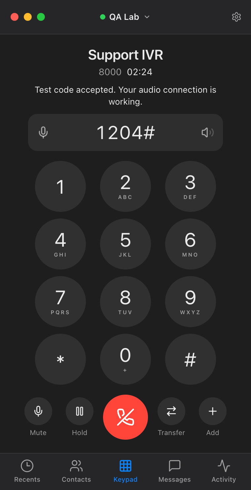
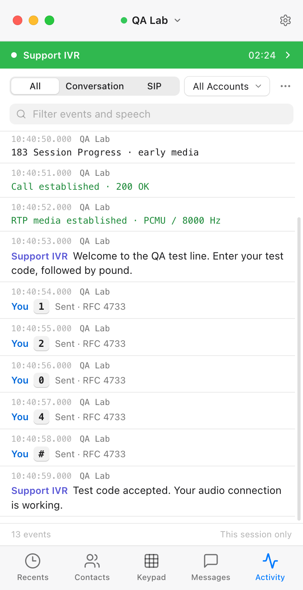
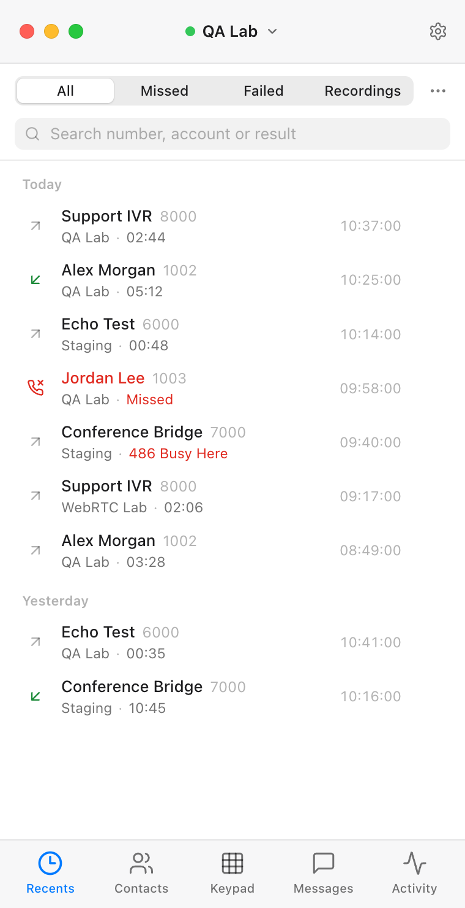
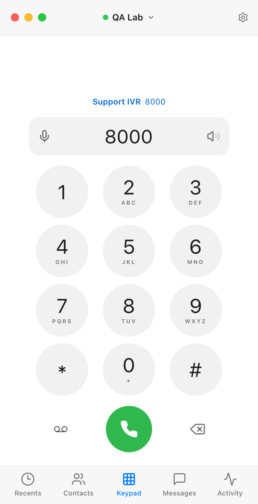
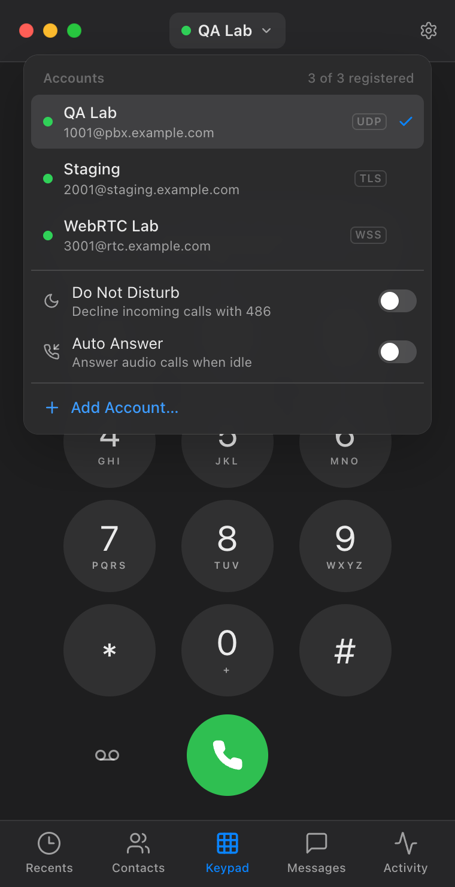

# DialDev

A desktop SIP softphone for QA and interoperability testing, with multiple accounts and an activity log for SIP events, DTMF, and call transcripts. The application uses Electron, React, and TypeScript, with Baresip for native SIP and SIP.js for WebRTC.



[Download for Mac](https://github.com/DuffyAdams/DevDial/releases/latest) · [Run from source](#run-from-source) · [Testing features](#testing-features) · [Screenshots](#screenshots)

The included native binary targets **Apple Silicon macOS 14+**. The interface and Electron application support macOS, Windows, and Linux; native SIP binaries must be built for each additional OS/architecture. Those targets are configured but have not been validated on Windows, Linux, or Intel Macs.

## Screenshots

Actual app screens captured at 2× resolution with fictional accounts, calls, and transcripts. The examples show staged UI states; no live SIP service is connected. Click an image to inspect it at full size.

| Active Call | Activity Log | Call History |
| :---: | :---: | :---: |
| [](docs/screenshots/active-call.png) | [](docs/screenshots/activity.png) | [](docs/screenshots/recents.png) |

<details>
<summary>Dialer and account switching</summary>

| Dialer | SIP Accounts |
| :---: | :---: |
| [](docs/screenshots/keypad.png) | [](docs/screenshots/accounts.png) |

The title bar shows the active line; click it to switch or manage accounts. The bottom tabs open Recents, Contacts, Keypad, Messages, and Activity.

</details>

## Open the app

### Download for Mac

Download the **DMG** from the [latest GitHub release](https://github.com/DuffyAdams/DevDial/releases/latest), open it, and drag **DialDev** into **Applications**. A ZIP of the same app is also available.

The release requires an **Apple silicon Mac (M-series) running macOS 14 or later**. It includes the native SIP engine; Node.js, Homebrew, and developer tools are not needed to run it. Configure your SIP accounts on the new Mac after installation.


### Updates

DialDev checks for a new release shortly after it opens (turn off **Settings → Check Automatically** to stop this). A red dot on the Settings gear means one is available, and **Settings → Software Update → Update & Restart** downloads it, replaces the app and reopens it. **DialDev → Check for Updates…** checks right away. Updating in place needs DialDev to be in a folder you can write to, such as Applications, and no calls in progress. Otherwise **Download** opens the release page.

To ship an update, publish a GitHub release tagged `vX.Y.Z` (higher than the current version) in the repository named by `UPDATE_REPOSITORY` in `electron/main.cjs`. Attach the `DialDev-X.Y.Z-macOS-arm64.zip` from `npm run dist:mac` and a `SHA256SUMS.txt` that lists it. That repository's releases must be publicly readable, because the app has no GitHub credentials. Before installing, DialDev checks the ZIP's SHA-256, then checks that the new app has the release version and the same bundle ID, and has a valid code signature from the same Apple team as the installed copy. Releases signed by a different certificate team are refused, as are pre-release tags.

This build is development-signed and **not notarized by Apple**. If macOS blocks the first launch, open **System Settings → Privacy & Security → Open Anyway** for DialDev, then confirm **Open**. See [Apple's first-launch instructions](https://support.apple.com/en-us/102445).

### Run from source

The local macOS application is generated at `release/mac-arm64/DialDev.app`.

Or run from source with Node 22.12+:

```sh
npm ci
npm run build
npm start
```

For development:

```sh
npm run desktop     # desktop app with live UI updates
npm run dev         # browser preview at http://127.0.0.1:5173 (WebRTC accounts only)
```

To build the Apple silicon DMG and ZIP locally, run `npm run dist:mac`. The versioned installers are written to `release/`; this command does not publish them. If Electron is already installed locally and downloading its archive is unavailable, append `-- --config.electronDist=node_modules/electron/dist`.

On macOS, both desktop commands prepare a locally signed `DialDev.app` runtime in `.dist/desktop/` on first launch. Its bundle name and icon match the packaged app, so the menu bar and Dock show **DialDev**. The runtime is reused until the app metadata, Electron version, or icon changes. Preparing it requires Xcode Command Line Tools (`xcode-select --install`).

### App icon

The app uses a light tile with a green circle and white handset. The source artwork is in `scripts/make-icon.swift` and `public/favicon.svg`; generated PNG and macOS ICNS assets are committed in `build/`. To regenerate the native icons on macOS, run `npm run icons`, then `npm run package` to rebuild the app.

## Add an account

On first launch the **New Account** sheet opens. The minimum is:

1. **SIP Server**: hostname or IP, with an optional port (`pbx.example.com`, `10.0.0.5:5080`).
2. **Transport**: UDP, TCP, TLS or WSS. The port defaults to 5060 (5061 for TLS).
3. **Username** and **Password**. The password is optional for servers that do not challenge.

Choose **Add Account** and it registers immediately. The dot next to the line name in the title bar shows the result: green when registered, orange while registering, red when registration fails. Open the accounts list to see the server's reason (for example `403 Forbidden`).

Shortcut: paste a SIP URI such as `sip:1001@pbx.example.com:5080;transport=tcp` into the server field and the host, port, username and transport are filled in for you.

**Advanced** holds the auth username, caller ID name, outbound proxy, SRTP requirement, STUN, TURN (WSS), voicemail number, *Register automatically* and *Remember password*. The optional **Label** names the account in the title bar and accounts list; it defaults to `user@host`.

### Several accounts

- Click the line name in the title bar (⌘L) to open the accounts list. It shows every account with its registration state, plus **Do Not Disturb** and **Auto Answer** switches and **Add Account…** (⇧⌘N). Up to 20 accounts, all registered at once.
- Click an account to make it the calling line. Right-click it (or use its ⋯ button) for **Register / Re-register**, **Unregister**, **Edit…**, **Duplicate**, **Copy SIP Address** and **Delete…**. Double-click to edit.
- **Duplicate** copies every setting, including the password, so a second extension on the same server, or the same extension on another server, takes one edit.
- Unregistered accounts stay off across restarts until you register them again.

For a WebRTC account choose **WSS** and enter the server's full secure WebSocket URL, such as `wss://pbx.example.com:8089/ws`. The SIP domain is taken from the URL when left blank. The PBX must accept WebRTC SDP, ICE and DTLS-SRTP, with a trusted TLS certificate.

Native audio negotiates **Opus, PCMU, or PCMA**. Native TLS validates the server's certificate using the bundled CA set; certificate validation is never disabled. TLS encrypts signaling; native media encryption requires selecting SRTP and server support. WebRTC uses DTLS-SRTP.

## Testing features

- **Test line** (development builds only: `npm run dev` and `npm run desktop`): dial **1234** to place a simulated call. Release builds dial 1234 like any other number, since it is a common real extension. It needs no account, registration or network. The call goes through Calling…, Ringing… (180) and Early media… (183) with an announcement, then connects to a short menu: **1** reads back the digits you sent, **2** sends you DTMF, **9** hangs up and calls you back (the incoming call screen), **#** hangs up and **\*** repeats the options. Its prompts show as captions and in Activity, labeled **Simulator**. Mute, Hold, Transfer and Add all work, and calls you add while on the test line are simulated too, so you can try Merge. Recording is not available, and test calls are not saved to Recents.
- **Activity log**: registration attempts and results, INVITE, ringing (180) and early media (183), call establishment, RTP and media-encryption events, DTMF sent and received, hold/resume, transfers and SIP close reasons, with millisecond timestamps. With transcription on, what each side says is interleaved on the same timeline. Show **All**, just the **Conversation** (speech and DTMF), or just **SIP** events; filter by account, search, copy or save it as a `.log` file. It is kept in memory for the session only.
- **Live transcription** (macOS 26 or later; on by default, in **Settings → Transcribe Calls** or the Activity ⋯ menu): both sides of every call are transcribed on the Mac with Apple's on-device speech model, starting with early media, so IVR announcements are captured before answer. Words appear within about a second and are refined as each phrase completes. The latest phrase also shows under the caller's name on the call screen; turn off **Settings → Show on Call Screen** to keep the transcript in Activity only. Choose a language in Settings (30 are supported). Its model downloads once if macOS doesn't already have it.
- **DTMF on the timeline**: digits you send (RFC 4733, or SIP INFO on WebRTC), digits received as telephone events or SIP INFO, and in-band DTMF tones heard in the remote audio, each labeled with how it arrived. A digit sits next to the prompt that asked for it, so you can see whether an IVR answered with an in-band tone or an RFC 4733 event.
- **Recents**: every call with its account, duration to the second, and SIP result (`486 Busy Here`, `404 Not Found`, missed). Filter by Missed or Failed, or switch to Recordings. Export as CSV or JSON. Click a row to load the number; double-click to call. The tab shows a badge for new missed calls.
- **DTMF**: the keypad stays on screen during calls, with Mute and Hold to the left of End and Transfer and Add to the right. With a second connected call, Merge takes Add’s place and **+** in the call strip adds another call. On video calls, the camera button sits on the video. Click keys or type digits on the keyboard; the digits sent on the call appear in the gray field above the keypad. Keys register on press, so fast input is not lost.
- **Audio levels**: microphone and speaker icons sit at the edges of the number field, on the keypad and the call screen. The microphone fills with the input level, and the speaker's waves light up with the output level (both turn red near clipping). Click either one for a larger meter, the microphone or speaker choice, call volume and a test tone. **Audio Settings…** opens the full Audio settings. The microphone level shows during calls and while its panel is open, and drops to zero when the call is muted or on hold. On native (UDP, TCP, TLS) calls it meters the Mac's default microphone, which is the one those calls use. Those calls play through the Mac's default output at the system volume, so their speaker level isn't shown, and device and volume choices apply to WebRTC calls and the test tone. A new microphone takes effect from the next call. A new speaker or volume applies immediately.
- **Recording**: turn on **Settings → Record Calls** to record both sides of every call once it connects (turning it on mid-call starts recording the calls already up). Click **REC** on the call screen to stop a recording. Recordings are under Recents → Recordings. Simulated test-line calls aren't recorded.
- **Call states**: the call screen distinguishes Calling…, Ringing… (180) and Early media… (183). Turn on **Settings → Show Call Details** to also show the full peer SIP URI and which account the call is on.
- **Do Not Disturb** and **Auto Answer** in the accounts list: decline incoming calls with 486, or auto-answer audio calls when idle. A moon or phone icon next to the line name shows when either is on.
- **During a call** you can switch tabs (for example to watch Activity). A green bar under the title bar shows the call and returns to it with one click.
- **Redial**: press Call with an empty number to load the last dialed number.
- Hold, mute, blind / consult / attended transfer, conference merge, recording, SIP MESSAGE and voicemail access are all available, subject to server support.

### Keyboard

| Action | Keys |
|---|---|
| Type a number, or send DTMF during a call (from any tab) | 0–9 * # |
| Call / delete / clear | Return / Delete / Esc |
| Focus the dial field | ⌘N |
| Accounts list | ⌘L |
| New account | ⇧⌘N |
| Recents, Contacts, Keypad, Messages, Activity | ⌘1 – ⌘5 |
| Settings | ⌘, |

Holding (or right-clicking) 0 on the keypad enters +.

## Included

| Capability | Native SIP | WebRTC |
|---|---|---|
| Server host/port, username, auth username, password | Yes | Yes, plus WSS endpoint |
| Up to 20 accounts registered simultaneously | Yes | Yes |
| Incoming/outgoing audio and caller identity | Yes | Yes |
| Mute, hold/resume, call waiting, redial, DTMF | Yes | Yes |
| Blind and attended SIP REFER transfers | Yes | Yes |
| Local audio conference (up to five remote parties) | Yes | Yes |
| Two-sided call recording | Stereo WAV | WebM/Opus |
| Do not disturb, audio auto-answer, SIP 302 forwarding | Yes | Yes |
| Activity log and history with SIP results | Yes | Yes |
| On-device live transcription of both sides (macOS 26+) | Yes, including early media | Yes, after answer |
| In-band DTMF tone detection | Yes | Yes |
| SIP MESSAGE conversations | Yes | Yes |
| Voicemail access and message-waiting subscription | Yes | Yes |
| Video calls and camera toggle | No | Yes |
| STUN | Yes | Yes |
| Configurable TURN | No | Yes |
| Microphone/speaker choice and device testing | System devices | In-app selection |

Transfers, forwarding, voicemail, messaging, and encryption require server support. Messaging is **SIP MESSAGE**, not a hosted SMS service. Native and WebRTC calls cannot be mixed into one local conference. Native audio uses the operating system's default audio devices; use a headset to avoid acoustic echo. Video auto-answer is deliberately not enabled.

The app also includes contacts for numbers you test often (with vCard import/export), recording playback/download, light/dark/automatic appearance, native menus, incoming call notifications, `tel:`/`sip:` URL handling in packaged builds, and sleep prevention during calls. Closing the macOS window leaves the app running to receive calls; quit from the application menu.

## Scope and remaining product work

This is a functioning **0.4 desktop softphone** for testing, not complete Bria product parity. Bria also offers services and integrations that need separate implementation: presence/BLF subscriptions, XMPP and group chat, cloud contact synchronization, macOS/Outlook address-book access, SMS integrations, file transfer, screen sharing, video conferences, device provisioning, enterprise administration, and enterprise update policies. Provider-specific codecs, enterprise certificate stores, accessibility contrast certification, emergency calling configuration, and wide interoperability certification are not completed.

Public distribution still needs your product identity, Apple Developer signing/notarization, Windows signing, platform-specific native builds, and testing against the actual telephone service. The app does not supply telephone service or configure emergency routing.

## Data and security

- Accounts (without passwords), contacts, preferences, call history, and SIP message history are local to the Electron profile. Recordings use IndexedDB. The activity log is held in memory and cleared when the app quits.
- Desktop passwords are protected by Electron `safeStorage` (macOS Keychain-backed encryption, Windows DPAPI, or a supported Linux secret store). Saving fails if Linux would fall back to basic/plaintext storage. Passwords can instead be kept only for the current session.
- Browser preview credentials are memory-only. Passwords are never stored in localStorage or written into native SIP configuration files.
- Native credentials are passed to the running engine over an authenticated, randomly bound loopback control connection and held in memory. The native adapter uses structured JSON, validates inputs, and suppresses parameter logging. Temporary recording audio is written with a private directory and deleted after successful import into the app.
- The renderer is sandboxed, has no Node integration, and uses a small context-isolated preload bridge. IPC validates the calling frame. Remote windows and navigation are blocked. SIP logs containing credentials or caller data are not retained.
- No telemetry, cloud backend, or analytics service is included.
- Transcription runs entirely on the Mac (Apple Speech); no audio or text leaves it. Call audio reaches the transcription helper through private FIFOs in the app's runtime directory and is never written to disk. Transcripts live only in the in-memory activity log, unless you copy or save it.
- Recordings and conversation history are local data, not application-level encrypted archives. Protect the OS account and disk. Announce recordings, and transcription, to participants where required.

## Build native SIP

The Apple Silicon native binary is included. Rebuilding uses pinned, checksum-verified Baresip 4.12.0, libre 4.12.0, and Opus 1.5.2 sources. The DialDev adapter is in `native/module/dialdev/`.

Requirements: C/C++ compiler, CMake, Python 3, `tar`, OpenSSL development/static libraries; Linux also needs PulseAudio development headers and pkg-config. Windows requires the corresponding native toolchain and dependency libraries (for example, vcpkg).

```sh
# Point to an OpenSSL build matching your desired OS deployment target.
OPENSSL_ROOT_DIR=/path/to/openssl npm run native:build
```

On macOS, the script targets macOS 14.0. Every static dependency must be built for that target too. Building on a newer OS with newer-target Homebrew libraries is insufficient even if the final executable reports an older minimum OS. The delivered binary uses a locally built OpenSSL 3.6.4 with the matching deployment target. `scripts/build-openssl-mac.sh` reproduces that dependency.

Outputs go to `native/<platform>-<architecture>/baresip` (or `baresip.exe`). Windows/Linux builds are source configurations, not validated release artifacts. Ship their required non-system shared libraries if the toolchain links any. There is no automatic fallback from standard SIP to WebRTC.

### Transcription helper

`native/darwin-arm64/dialdev-transcribe` is included. It is a small Swift program (`native/transcriber/main.swift`) that runs on macOS 14+ and transcribes on macOS 26+, where `SpeechAnalyzer` is available; older systems show the reason in Settings. Rebuild it with Xcode or the Command Line Tools:

```sh
npm run native:transcriber
```

Baresip streams each side of a call to the helper through two FIFOs; WebRTC calls send audio from an AudioWorklet through the main process. The helper reports speech with wall-clock timestamps aligned to where speech starts, plus in-band DTMF, as JSON lines. Windows and Linux builds have no helper yet and show transcription as unavailable. A whisper.cpp helper that speaks the same protocol could fill that gap.

```sh
npm run package       # unpacked application
npm run dist:mac      # macOS DMG and ZIP
npm run dist:win      # Windows NSIS installer, on a suitable build host
npm run dist:linux    # Linux AppImage, on a suitable build host
```

## Verification

To regenerate the README images on macOS after UI changes, run `node scripts/capture-screenshots.cjs` after installing dependencies. The script launches a temporary Vite server and an isolated Electron profile, loads fictional fixtures into the real renderer, and writes the five screen captures and composed overview to `docs/screenshots/`. It blocks external requests and device permissions, then removes the temporary profile. The production app and your saved accounts are not used.

```sh
npm test             # call lifecycle, logging, account parsing/validation, dialing, vCard, IPC validation
npm run test:native  # real SIP/RTP loopback integration; synthetic audio only
npm run test:transcriber  # on-device transcription and in-band DTMF (macOS 26+; uses the `say` voice)
npm run build        # strict TypeScript and optimized production build
```

The native test checks digest authentication with a special-character password, SDP negotiation, actual synthetic RTP audio, two-sided recording, hold/resume re-INVITEs, RTP telephone events, SIP message acceptance/rejection, BYE cleanup, inbound caller identity, and call rejection. On macOS 26 it also plays a synthetic IVR over PCMU RTP into a native call. It checks that the prompt is transcribed and that an in-band tone and an RFC 4733 event are each reported with the right digit. It never uses a real account or microphone.

The interface was checked in the browser preview (light and dark, at the default 380×740 and minimum 360×600 window sizes) and in the desktop build, including adding a UDP account through the UI and watching it register through the native engine. Live WebRTC media, macOS hardware audio, TLS/SRTP interoperability, and other operating systems need further endpoint/hardware testing.

## Project map

- `src/App.tsx` — window layout, persistent data, account lifecycle, and shortcuts
- `src/components/` — accounts popover, phone panel (dial pad and call screen), account and settings sheets, and the Recents, Contacts, Messages and Activity tabs
- `src/lib/phone.ts` — unified call lifecycle and WebRTC engine
- `electron/main.cjs` / `preload.cjs` — native shell, credentials, menus, notifications
- `electron/native-sip.cjs` — authenticated native bridge, validation, recording import
- `electron/transcriber.cjs` — runs the transcription helper per call and relays its results
- `native/transcriber/` — on-device transcription and in-band DTMF detection (Swift, Apple Speech)
- `native/module/dialdev/` — native SIP controls, PCM recording filter, and live audio streaming for transcription
- `scripts/` — build tooling and native source patching
- `tests/` — unit and real loopback integration checks

Upstream references: [Baresip](https://github.com/baresip/baresip), [SIP.js guides](https://sipjs.com/guides/), [Electron security](https://www.electronjs.org/docs/latest/tutorial/security), and [Bria feature reference](https://docs.counterpath.com/docs/DeskUG/clients/UserGuides/Desktop/intro/deskUserGuideIntro.htm). Third-party licenses are in `native/licenses/` and the installed npm packages.
